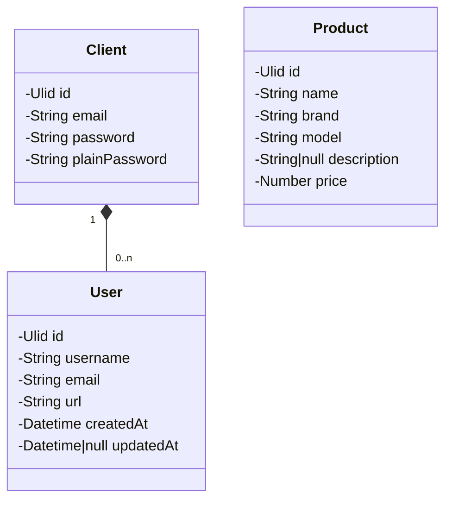

```mermaid
classDiagram

class Client {
    -Ulid id
    -String email
    -String password
    -String plainPassword
}

class User {
    -Ulid id
    -String username
    -String email
    -String url
    -Datetime createdAt
    -Datetime|null updatedAt
}

class Product {
    -Ulid id
    -String name
    -String brand
    -String model
    -String|null description
    -Number price
}

Client "1"*--"0..n" User
```

