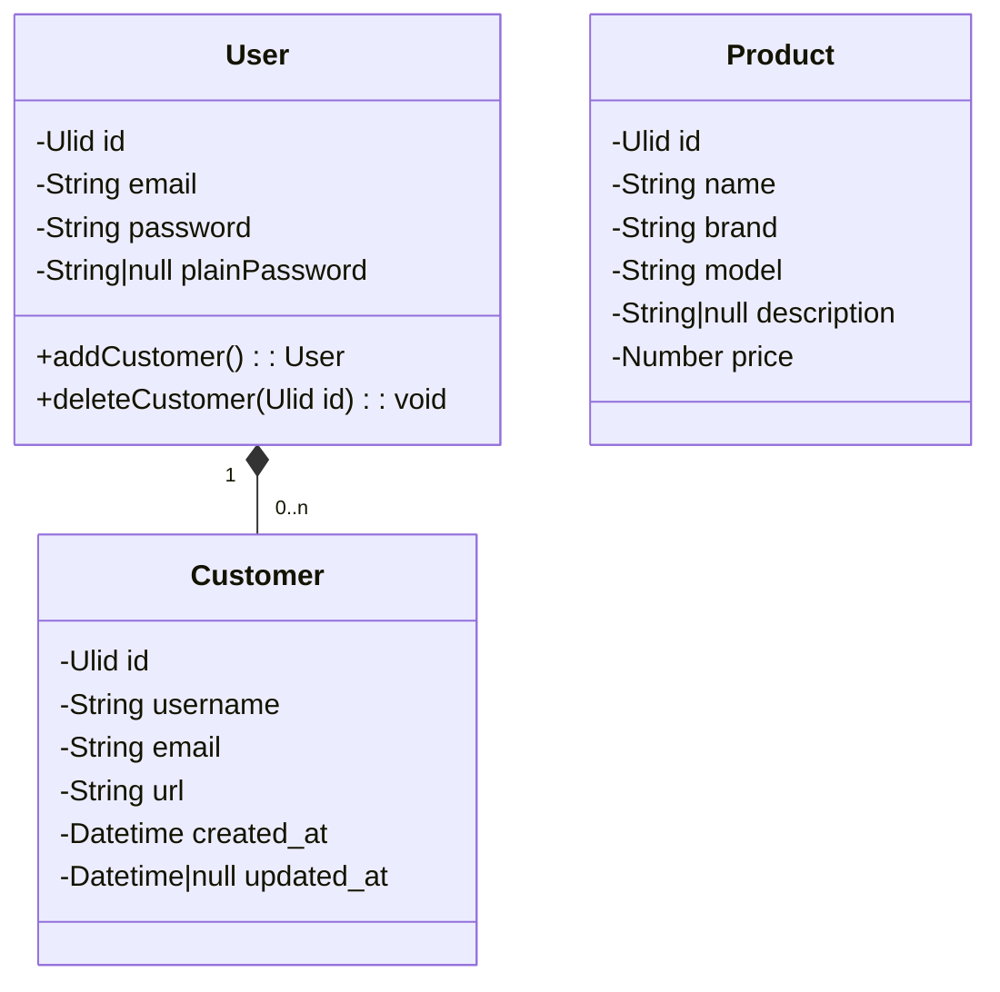

```mermaid
classDiagram

class User {
    -Ulid id
    -String email
    -String password
    -String|null plainPassword
    
    +addCustomer(): User
    +deleteCustomer(Ulid id): void
}

class Customer {
    -Ulid id
    -String username
    -String email
    -String url
    -Datetime created_at
    -Datetime|null updated_at
}

class Product {
    -Ulid id
    -String name
    -String brand
    -String model
    -String|null description
    -Number price
}

User "1"*--"0..n" Customer
```

