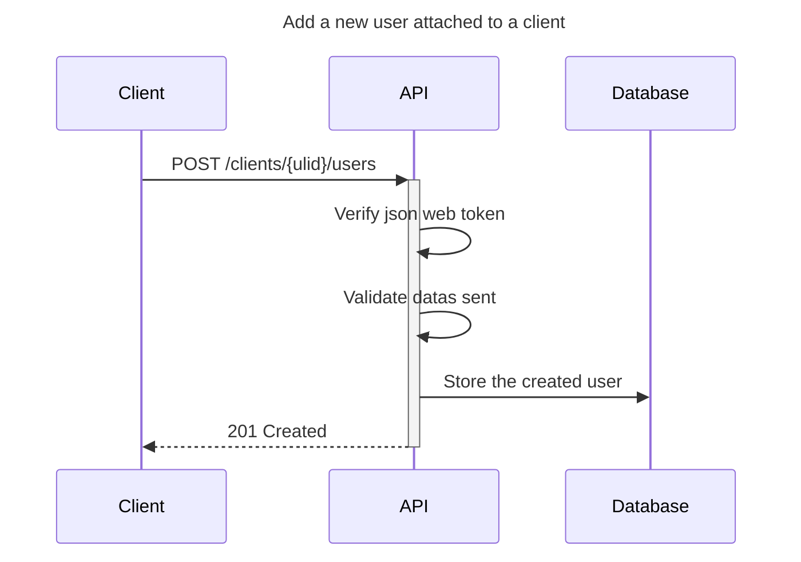

```mermaid
sequenceDiagram
title Add a new user attached to a client

Client->>+API: POST /clients/{ulid}/users

API->>API: Verify json web token
API->>API: Validate datas sent

API->>Database: Store the created user

API-->>-Client: 201 Created
```
