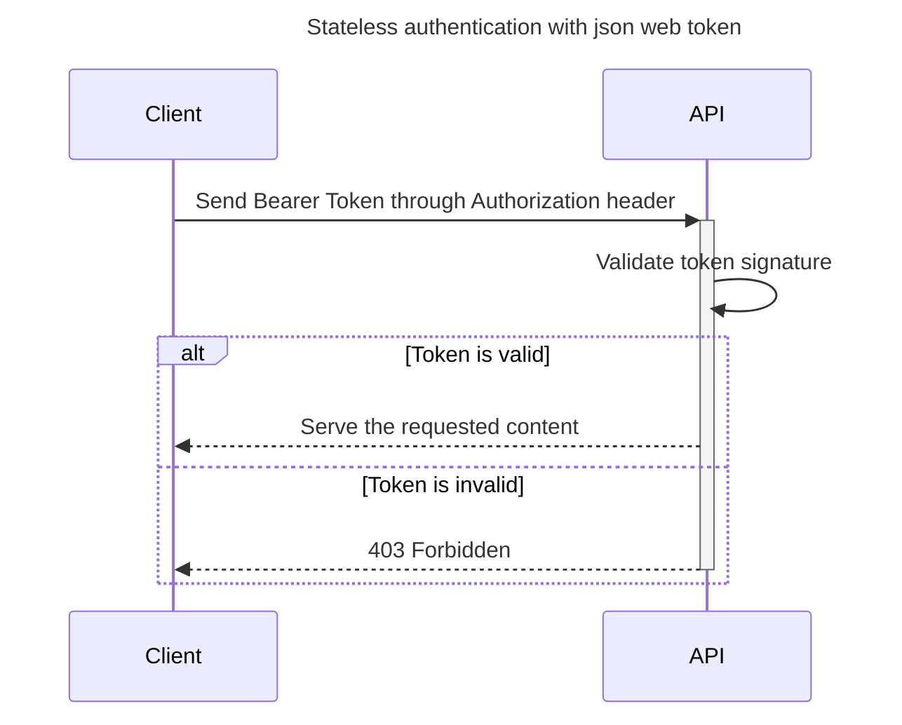

```mermaid
sequenceDiagram
title Stateless authentication with json web token

Client->>+API: Send Bearer Token through Authorization header
API->>API: Validate token signature

alt Token is valid
    API-->>Client: Serve the requested content
else Token is invalid
    API-->>-Client: 403 Forbidden
end
```
