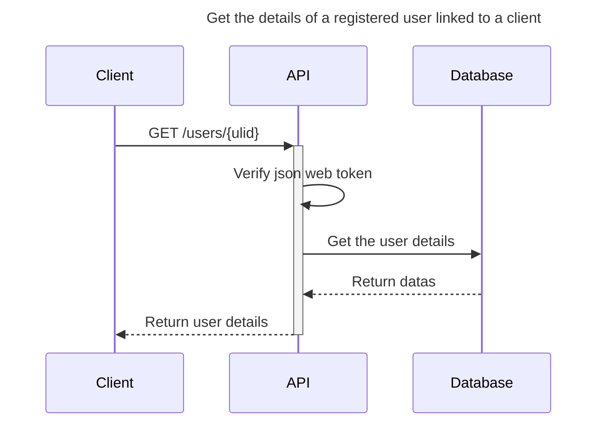

```mermaid
sequenceDiagram
title Get the details of a registered user linked to a client

Client->>+API: GET /users/{ulid}


API->>API: Verify json web token

API->>Database: Get the user details
Database-->>API: Return datas

API-->>-Client: Return user details
```
